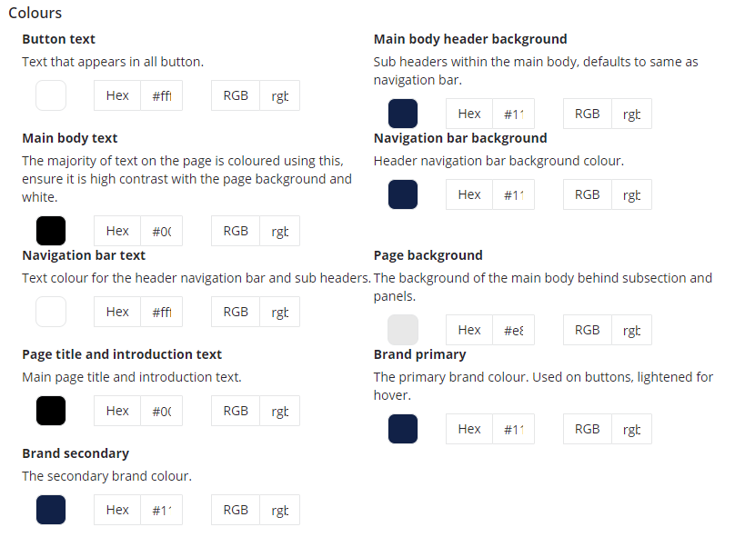
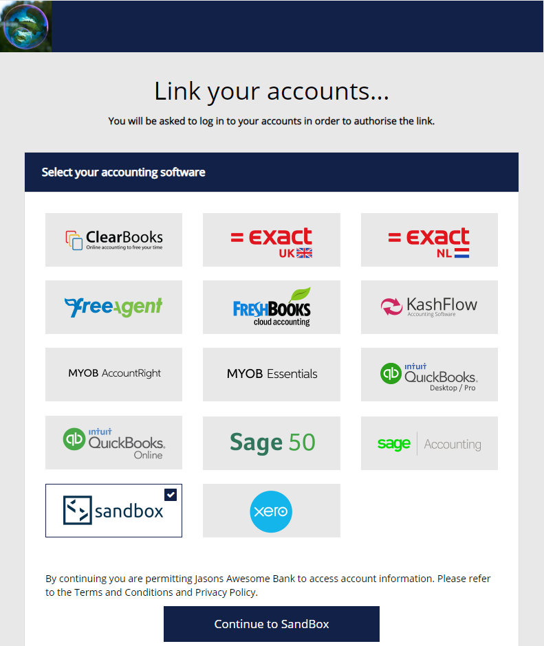
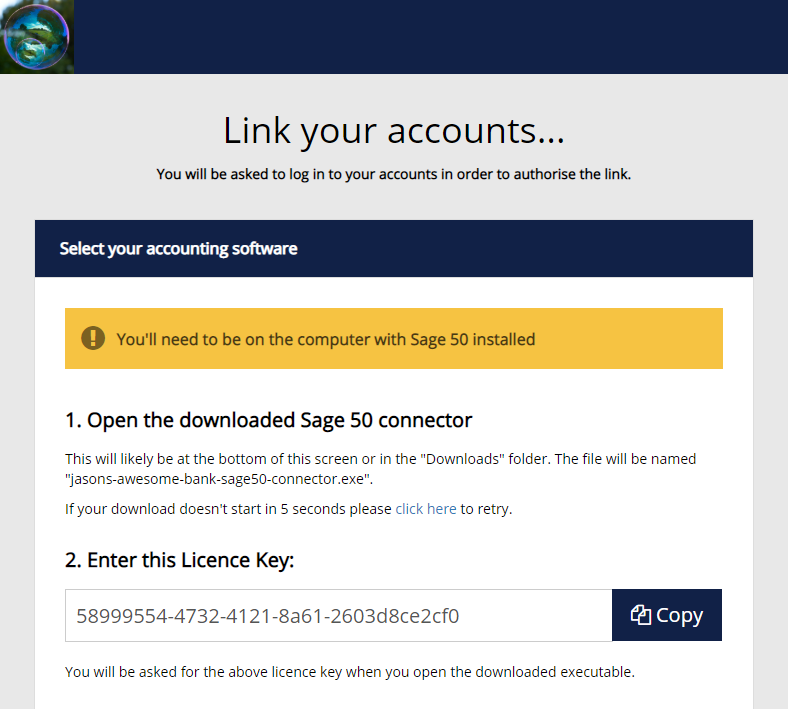
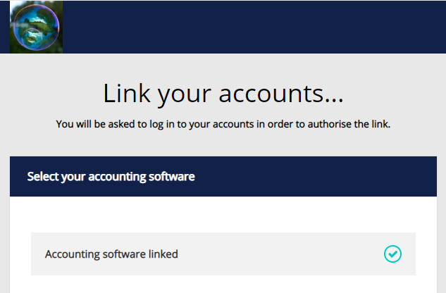

- title : Codat - Auth
- description : An overview of the Codat Auth feature.
- author : Jason Dryhurst-Smith
- theme : night
- transition : default

***

# 🔐 ➡ 🔓

## Codat Link

#### A workflow for 3rd party authorisation

---

<div style="text-align:justify; padding: 30px; font-size: 90%;">

## There is a lot to get through, so I would ask that you hold questions until the end, or speak to me after this session. If a few people have similar questions, it might be better to arrange for a session on that topic.

## <b style="color:#47113D">Thank.</b>

</div>

---

### Nomenclature Refresher

</br>
<div style="text-align:left; padding-left: 30px;">

#### 🤝 Client - our customer

</br>

#### 🙌 Company - our client's customers

</br>

#### 👐 Data Connection - link between a company and a 3rd party

</div>

---

<div style="text-align:left; padding-left: 150px;">

## 1. Client Facing
## 2. Internal 
## 3. Technical 

</div>

***

# 🏪

<div style="text-align:left; padding-left: 150px;">

## 1. Client Facing 

### 1.1. Link API
### 1.2. Link Site

</div>

***

# 🤖

## 1.1. Link API

#### Standardised 3rd Party Authorisation Flow

</br>

<div style="text-align:left; padding-left: 150px;">

### 1.1.1. Credentials
### 1.1.2. Start
### 1.1.3. Redirect

</div>

--- 

### 1.1.1. Credentials & Overview


<div style="text-align:justify; padding: 0 50px;">

</br>

#### We are asking a <i style="color: #0F0;">user</i> for <i style="color: #0F0;">authorisation</i> to their data held by a <i style="color: #0F0;">software vendor</i> on <i style="color: #0F0;">behalf of our client</i>.

</br>

#### This means that we have to borrow our <i style="color: #0F0;">client's identification</i> to get through the front door. We call this identification <i style="color: #0F0;">credentials</i>.

</br>

#### For us to get authorisation, a user will typically will be asked to <i style="color: #0F0;">authenticate</i> by the software vendor, this is called a challenge. Once the challenge is complete we are rewarded with <i style="color: #0F0;">tokens</i>...

</div>

### 🏆

---

### 1.1.2. Start

#### Start the linking process with the third party, agnostic of the technical method of authorisation or authentication.

```
https://link.codat.io/link/start
    /{companyId}
    /{dataConnectionId}
```

</br>


<div style="text-align:left">

- The Codat identifier for the company you wish to link

</div>

#### Company ID 

<div style="text-align:left">


- The connection between the Company and the 3rd party system

</div>

#### Data Connection ID 

---

### 1.1.3. Redirect

#### Signals the end of a linking process with a 3rd party, used to notify the Client of success or failure.

```
https://{verified-host-name}/anything-you-like?
    statusCode={statusCode}&
    statusText={statusText}
```

</br>

<div style="text-align:left">

- Security - Only notify known parties via host name ownership

</div>

####  Verified Host Name 

<div style="text-align:left">

- Machines - A number that corresponds to the status of the link

</div>

####  Status Code 

<div style="text-align:left">

- Humans - Some text that corresponds to the status of the link

</div>

#### Status Text

---

# 🍟🍔🥤

## Bonus Features

<div style="text-align:left; padding-left: 30px;">


#### 1. Open ID Connect

Share the identity of the authorising user, where supported by the integration or enable one-click sign-up.

#### 2. Parameter Passing

Any parameters passed during the `start` process will be securely stored and passed back in the `redirect`. This allows for sharing internal information such as IDs with Codat, but not the 3rd party.

</div>

***

# 🐱‍💻

## 1.2. Link Site

#### No code, white labelled implementation of the Link API

</br>

<div style="text-align:left; padding-left: 150px;">

### 1.2.1. White-Labelling
### 1.2.2. Integration Selection
### 1.2.3. Offline Licence
### 1.2.4. Success Page

</div>

---

## 1.2.1. White-Labelling



---

### White-Labelling

</br>
#### All of the link UI pages use a set of variables to allow customisation of the look of the Link Site for a given Client.

</br>

<div style="text-align:left; padding-left: 30px;">

### 1. Text and titles

### 2. Background and text colours

### 3. Company logo

</br>

Note: That's all we support, it's not powerful enough to support native looking integration with a Client's app. It's a good tool for non tech Clients and a stop-gap for tech ones.

</div>

---

## 1.2.2. Integration Selection



---

### Integration Selection

</br>

- Takes a Company ID and creates a Data Connection without the Client needing to know what software the user has selected.

</br>
</br>

```
https://link.codat.io
    /{companyId}/link
```

---

## 1.2.3. Offline Licence



---

### Offline Licence

</br>

- Displays a helpful prompt to the user about how to install the offline connector.

</br>
</br>

```
https://link.codat.io
    /{companyId}/licence/{dataConnectionId}
```

---

## 1.2.4. Success



---

### Success

</br>

- Displays a helpful prompt to the user to inform them they have completed the linking process.

</br>
</br>

```
https://link.codat.io
    /{companyId}/success
    ?redirect={redirect}
```


<div style="text-align:left">

- Allows the Client to specify a URL that the user can be sent to after the link is complete. Typically the home page of the Client or their app.

</div>

#### Redirect

***

# 🏭

<div style="text-align:left; padding-left: 150px;">

## 2. Internally Facing 

### 2.1. Parameter Passing
### 2.2. Integration Specific Details
### 2.3. Credentials
### 2.4. Tokens

</div>

***

## 🍣

<div style="text-align:left; padding-left: 12%;">

## 2.1. Parameter Passing 

### 2.1.1. Open ID Connect
### 2.1.2. Reserved Keys

</div>

---

## 2.1.1. Open ID Connect

This is an open standard for SSO (single sign on) and identification sharing built on top of OAuth 2.0. We can support the later use case with a query parameter however

#### Start

```
https://link.codat.io
    /link/start/{companyId}/{dataConnectionId}
    ?openId=true
```

#### Redirect

```
https://client-verified-host
    ?email={openId_email}
    &name={openId_given_name}
```

---

## 2.1.2. Reserved Keys

</br>

These cannot be used as parameter names our clients as they are reserved by Codat:

</br>

```
clientId
companyId
connectionId
platformKey
integrationId
sourceId
```

---

## 2.2. Integration Specific Details

</br>

<div style="text-align:justify; padding: 0 50px;">

In many instances a single user account for a software vendor will have access to multiple sets of data. 

So we will at times have to ask the user to select which one they want to link. 

This might also include selecting other properties, such as the reporting currency.

</div>

---

## 2.3. Credentials

The credentials used by a given integration can be anything that the integration needs for authorisation, but they can also be used to specify client specific configuration for a given integration.

</br>

#### Options, not widely supported, but well defined:

- OmitLineItems : bool - if an integration has no ability to pull back invoices with line items in bulk, this can speed up fetching data.

- RequiredAccessLevel : enum [ReadOnly, ReadWrite] - allows a client to define the level of access to an integration's API.

---

## 2.4. Tokens

<div style="text-align:justify; padding: 0 50px;">

Once we have been authorised to access data from a 3rd party, we will usually have a set of tokens for that Company.

Stored in `codatcredentials`

</div>

</br>

#### ⚠ Technical Bit ⚠

<div style="text-align:justify; padding: 0 50px; font-size: 80%;">

Automatically refresh by `Codat.Http.OAuth.OAuth2`

This refresh is also covered by a distributed lock provided by `Codat.Infrastructure.Locking`, it uses RedLock which has been mathematically proven to be fallible. Reality has little care for maths however, and it has never failed to be adequate for this use case. Beware if the IO to the state you are trying to lock it faster than the IO to the lock, you might still come into racey problems. Stick to using it to lock around HTTP calls and you'll be fine.

</div>

***

# 🐱‍💻

<div style="text-align:left; padding-left: 30%;">

## 3. Technical 

### 3.1. Link Store
### 3.2. Link Site Nugets
### 3.3. Proto-Buf

</div>

---

## 3.1. Link Store

#### Stored in `codatcredentials` azure storage and keyed from the Data Connection ID, accessible through the Link API.

#### Think of this like a `HttpContext` for every link flow undertaken:

<div style="font-size: 80%">

1. Request parameters.
2. Default link parameters
    1. Client ID
    2. Company ID
    3. Data Connection ID
    4. Platform Key
3. Any parameters a downstream service wants to add
    1. Open ID Connect values

</div>

<div style="text-align:justify; padding: 2%; font-size: 75%">

A downstream service can use these parameters to save having to go to another service for data relevant to the current link flow. We should be favouring using this store rather than going to the Clients API every other line of code to get the Company model, just to get the Client ID.

</div>

---

# 🌮

<div style="text-align:left; padding-left: 10%;">

## 3.2. Link Site Nugets

### 3.2.1. Codat.LinkSite.Contract
### 3.2.2. Codat.LinkSite.HttpClient
### 3.2.3. Codat.LinkSite.Error

</div>

---

## 3.2.1. Contract

</br>

This is pretty bare, it defines the contract for the white-labelling and nothing else. Most of what the Link API talks is .NET primitives.

---

## 3.2.2. HttpClient

#### Link URI Builder

```
public interface ILinkSiteUriBuilder
{
    GetLinkSiteUri
    GetDataConnectionRedirectUri
    GetLinkingCompleteUri
    GetErrorRedirectUri
}
```

Allow a client to build URLs to do common Link Api actions, like start a link flow and call the final callback.

---

## 3.2.2. HttpClient

#### Link Client

```
public interface ILinkSiteClient
{
    // Interact with the link store
    GetCompanyId  
    GetDataConnectionStoreValue
    GetDataConnectionStore
    UpdateDataConnectionStore
    CreateDataConnectionStore
    
    // Interact with white-labelling
    GetCustomUiAsync
    SetCustomUi
}
```

---

## 3.2. Proto-Buf

The Link API has our longest serving proto-buf implementation, this is one of the things that makes using the Link Store so slick. 

It's easy to enable in your consuming service.

```csharp
public void ConfigureServices(IServiceCollection services)
{
    var typeModel = RuntimeTypeModel.Default;

    // This comes from the Codat.LinkSite.HttpClient package
    // Not strictly necessary if you are only using the Link Store.
    LinkSiteContractTypeModel.AddTypes(typeModel);

    services.ConfigureCodatApiServices(_apiSettings, options =>
    {
        // This comes from the Codat.Http.Serialisation.Client.Protobuf nuget
        options.AddProtobufMediaTypeFormatters(typeModel);
    });
}

// Deep inside the Codat.LinkSite.HttpClient.
new ServiceRequest(HttpMethod.Get, $"link/{dataConnectionId}/store")
    // This makes the magic content negotiation happen.
    .AddProtobufHeaders();
```

***

<div style="width:33%; height: 100%; display: inline-block; vertical-align: top;">
   
</div>
<div style="width:65%; height: 100%; display: inline-block; text-align: left; padding-top: 10px;">
### <span style="color: #464B4B; font-size: 120%;">Thanks</span>
### <span style="color: #416F85; text-shadow: none; font-size: 75%;">Email: jason@codat.io</span>

</div>