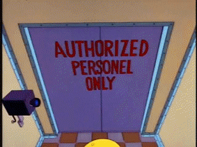
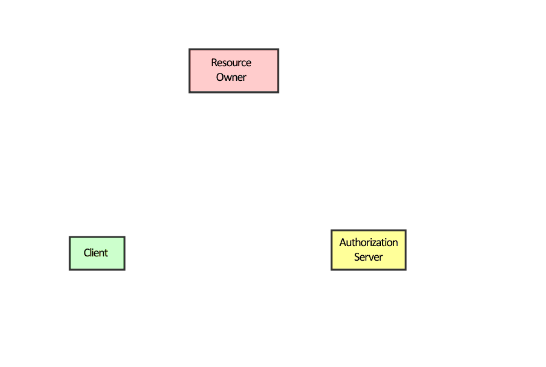
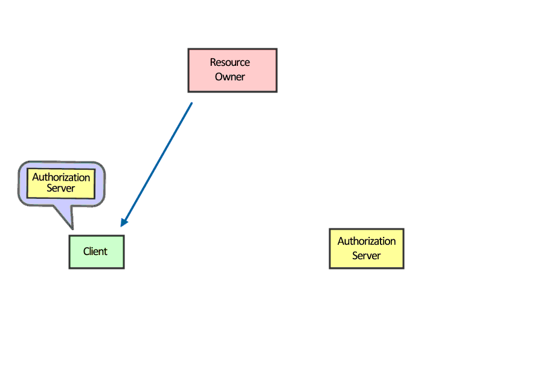
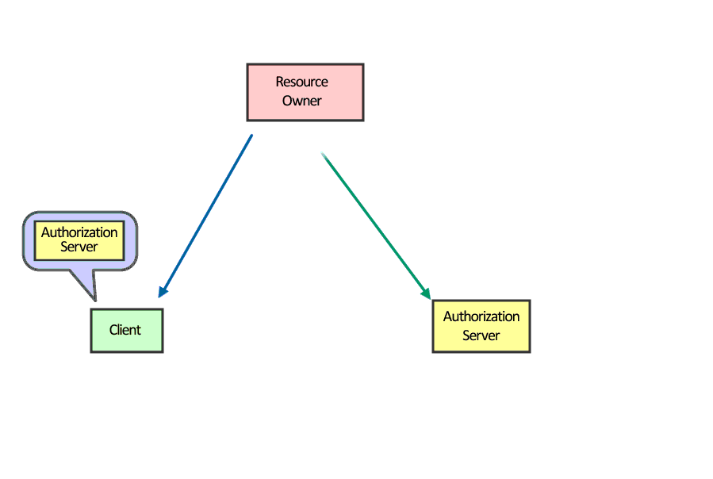
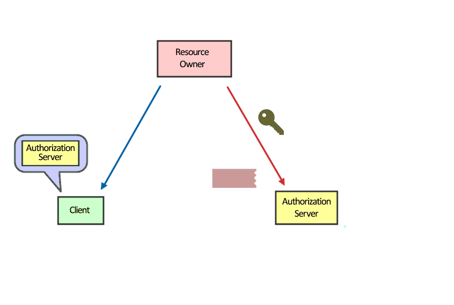
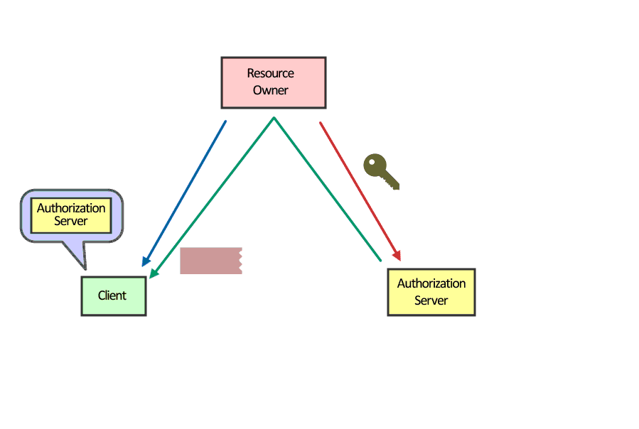
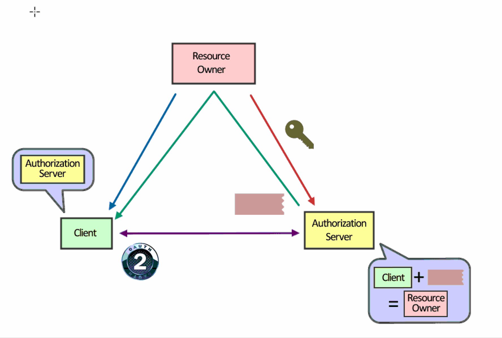
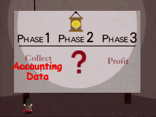
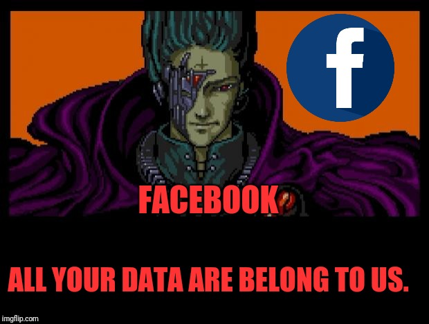

- title : OAuth
- description : An introduction to OAuth for a non-tech audience.
- author : Jason Dryhurst-Smith
- theme : night
- transition : default

***
 
# OAuth

---

## Agenda

1. What is it?
2. How does it work?
3. Why 2 versions?

## Not

1. Comprehensive technical implimentation discussion
2. Complete history of authorisation protocols
3. Codat implementation specifics

#### See me after class

***

## Three Legged Authorisation

1. Resource Owner
2. Authorising Service
3. Client

---

## 1. Resource Owner
## Or. End User

The individual user that wants to grant access.

---

## 2. Authorising Service 
## Or. Data Holder

The owner or holder of the users data.

---

## 3. Client 
## Or. Requesting Service

The service that wishes to gain access to the users data. 

### This is Codat.

***

### How does that work?

***

#### User clicks link URL

---

#### We redirect to the 3rd party

---

#### The user authorises with username and password

---

#### Authorisation server generates code

---

#### Exchange the code for some tokens.

---

---

***

## OAuth 1.0a vs OAuth 2.0

#### Protocols vs Frameworks

---

## OAuth 1.0/1.0a

A complete and internally consistent protocol for authorisation.

### Old

---

## OAuth 2.0

An incomplete framework for building authorisation protocols.

### New

---

---

#### Eran Hammer resigned his role of lead author for the OAuth 2.0 project, withdrew from the IETF working group, and removed his name from the specification. 
### It is all about enterprise use cases, that is not capable of simple. 
#### A blueprint for an authorization protocol, that is the enterprise way, providing a whole 
## new frontier to sell consulting services and integration solutions.

---

#### The goal of the IETF 

create a authorisation standard that would put the power in the users hand, allow a web standards approach to to granting access for 3rd parties to access data that a user owned... LOL!

***

[A complete run through of OAuth to quite a deep level.](https://medium.com/@darutk/diagrams-and-movies-of-all-the-oauth-2-0-flows-194f3c3ade85)

#### https://medium.com/@darutk/diagrams-and-movies-of-all-the-oauth-2-0-flows-194f3c3ade85

***

   

### Thanks

##### Generation
**[FsReveal](https://github.com/fsprojects/FsReveal)** for slides

##### The Internet
**[the internet](https://google.co.uk)** for all the great gifs

