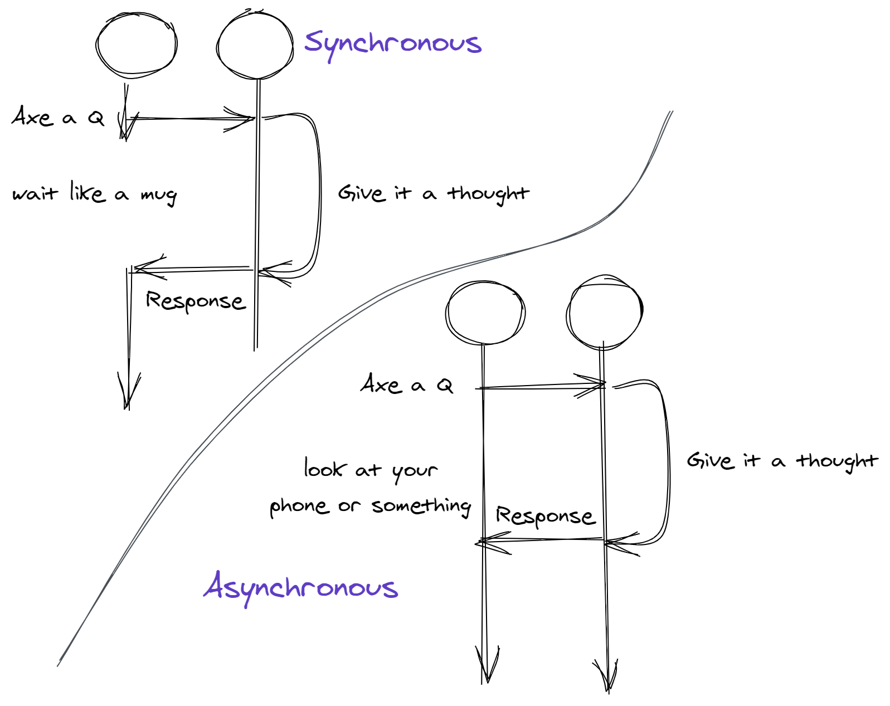
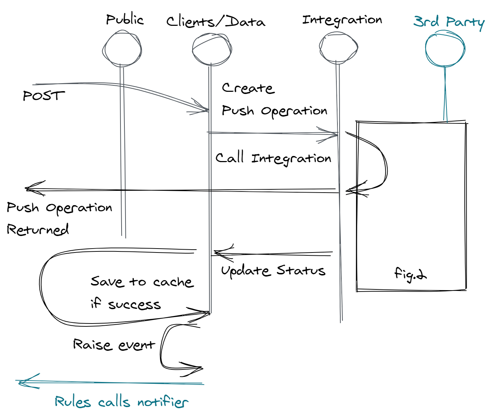
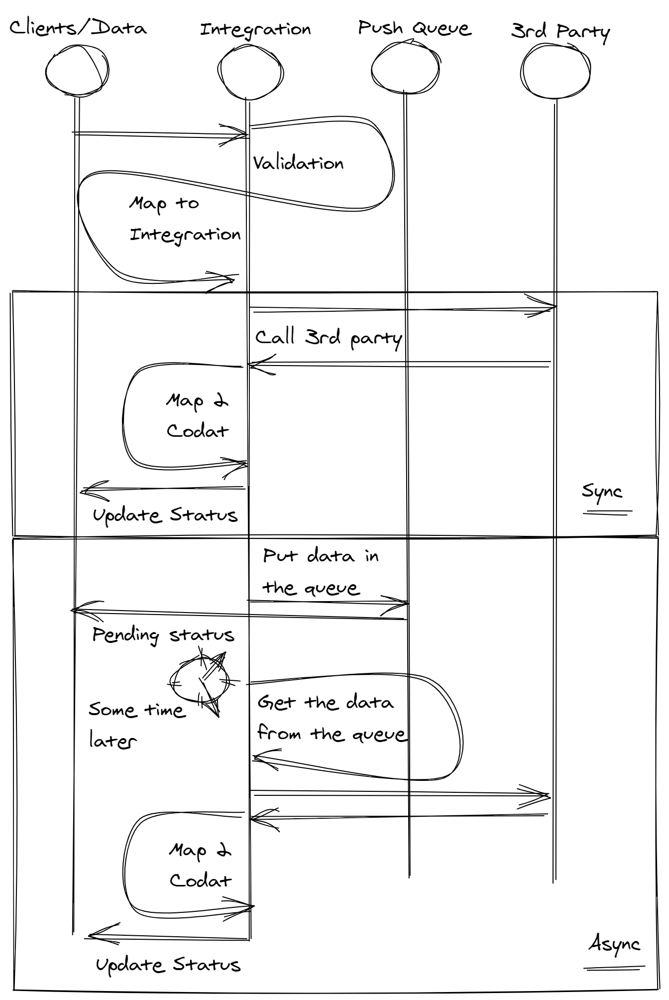

- title : Codat - Push
- description : An overview of the Codat Push feature.
- author : Jason Dryhurst-Smith
- theme : night
- transition : default

***

</br>
</br>

# 👋 ➡ 💾 ➡ ⛅

## Codat Push

#### Creating and updating data on behalf of our clients

##### Where the fun really starts

---

<div style="text-align:justify; padding: 30px; font-size: 90%;">

## There is a lot to get through, so I would ask that you hold questions until the end, or speak to me after this session. If a few people have similar questions, it might be better to arrange for a session on that topic.

## <b style="color:#47113D">Thank.</b>

</div>

---

### Nomenclature Refresher

</br>
<div style="text-align:left; padding-left: 30px;">

#### 🤝 Client - our customer

</br>

#### 🙌 Company - our client's customers

</br>

#### 👐 Data Connection - link between a company and a 3rd party

</br>

#### 👌 Contributed Data - data that has been contributed to the Codat system by a third party.

</div>

---

<div style="text-align:left; padding-left: 150px;">

## 1. Client Facing
## 2. Internal 
## 3. Technical 

</div>

***

# 🏪

<div style="text-align:left; padding-left: 150px;">

## 1. Client Facing 

### 1.1. Data model
### 1.2. Pushing

</div>

---

# 👯‍♂️

<div style="text-align:left; padding-left: 150px;">

## 1.1. Data model

### 1.1.1. Push Operations
### 1.1.2. Options

</div>

#### Metadata and mechanics

</br>

<div style="text-align:justify; padding: 0 50px;">

*Please see the previous session `Pull` for more details about the Data Types, Datasets, and Data Sources, that make up the standard for business information*

</div>

---

### 1.1.1. Push Operations

#### Returned when a Client 'pushes' to a Data Type

```
POST https://api.codat.io
    /companies​/{companyId}​
    /connections​/{connectionId}
    /push/{dataType}
```

<div style="text-align:justify; padding: 0 50px;">

</br>

The data the client wants to push.

#### A letter

The associated metadata.

#### An envelope (that's signed for with tracking)

---

### 1.1.1. Push Operations

#### Retrieving push operations

</br>

```
GET https://api.codat.io/companies​/{companyId}
    /push
```

Look back at the history of things that have been pushed.

</br>

```
GET https://api.codat.io/companies​/{companyId}​
    /push/{pushOperationKey}
```

This can be used to check on the status of a specific Push Operation.

---

### 1.1.2. Options

#### Describe the constraints on the data you are allowed to push

<div style="text-align:justify; padding: 0 50px;">

During a `Pull` integration specific business rules have to be standardised, it's `lossy`, information about the 3rd party is lost.

When we Push some of these rules have to be obeyed, and so information specific about the 3rd party has to be presented to the user of the API.

</div>

```
GET https://api.codat.io/
    /companies​/{companyId}​
    /connections​/{connectionId}​
    /options​/{dataType}
```

---

### 1.1.2. Options

#### JSON schema

<div style="text-align:justify; padding: 0 50px;">

The options are a schema, which is a code friendly way of creating a specification for the `structure`. 

Clients can use this schema to build an interface dynamically or as a guide to writing integration specific code... 👇

</div>

```json
{
    "type": "Object",
    "displayName": "Supplier",
    "description": "A Supplier is a person or organisation that provides a product or service",
    "required": true,
    "properties": {
        "supplierName": {
            "type": "String",
            "displayName": "Supplier Name",
            "description": "The name for the supplier, typically a company name",
            "required": true,
            "validation": {
                "warning": [{
                        "field": "supplierName",
                        "details": "Name must be fewer than 30 characters"
                    }
                ]
            }
        },
        "status": {
            "type": "Number",
            "displayName": "Supplier Status",
            "description": "The current state of the supplier",
            "required": true,
            "options": [{
                    "value": "Active",
                    "type": "String",
                    "displayName": "Active",
                    "required": false
                }, {
                    "value": "Archived",
                    "type": "String",
                    "displayName": "Archived",
                    "required": false
                }
            ]
        }
    }
}
```

---

# 👯‍♂️

<div style="text-align:left; padding-left: 275px;">

## 1.2. Pushing

### 1.2.1. Async Model
### 1.2.2. Timeouts
### 1.2.3. Alerts

</div>

#### Important things to think about

---

### 1.2.1. Async Model

#### Push Operations operate asynchronously

</br>

> "I've heard that word a lot at Codat. What does async mean when we talk about it?" - You

---



---

### 1.2.1. Async Model

<div style="text-align:justify; padding: 0 50px;">

In the world of Push Operations this translates to Codat accepting the request to Push the provided data and stating that the work might be carried out later and the status of the Push Operation might change.

##### Statuses

**Pending** - All the Push Operations start in this state.

**Success** - The data was pushed successfully.

**Failed**  - The data was not pushed successfully (see errors).

**TimedOut** - We didn't try to push the item as the timeout was reached before we could.

</div>

---

### 1.2.2. Timeouts

<div style="text-align:justify; padding: 0 50px;">

A client can specify a timeout for a Push Operation, this is a time that we will continue to attempt to push.

</div>

</br>

#### Why?

<div style="text-align:justify; padding: 0 50px;">

Some of the business operations that people might ask us to carry out might be time critical. 

Some of the users they send data to may be using a piece of desktop software that is offline for extended periods. 

</div>

---

### 1.2.3 Alerts - Rule Types

</br>

<div style="text-align:left; padding-left: 50px;">

#### 1. Push Operation Completed

Fired whenever a Push Operation moves to a final state.

This means that we can bring together all of that great async architecture and allow our clients to be notified about changes of status.

#### 2. Push Operation TimedOut

Fired whenever a Push Operation times out.

</div>

***

# 🏭

<div style="text-align:left; padding-left: 150px;">

## 2. Internally Facing 

### 2.1. Flow
### 2.2. Data Model Validation
### 2.3. Monitoring (or lack of)

</div>

---

# 🌊

<div style="text-align:left; padding-left: 150px;">

## 2.1. Flow

### 2.1.1. Overview
### 2.2.2. Synchronous Integration
### 2.2.3. Asynchronous Integration
### 2.2.4. Errors

</div>

#### Push Operations as they move through the system


---



---



---


---

<div style="text-align:left; padding-left: 150px;">

### 1. Validate
### 2. Map to platform
### 3. Push
### 4. Map to Codat
### ♾. Handle errors at all stages

</div>

---

### 2.2.4. Errors

<div style="text-align:justify; padding: 0 50px;">

There are a few classes of errors that are important to distinguish:

</br>

**Validation Error** - Facilitated via the `ValidationResult` model, same as Datasets.

**Pre-processing Error** - An error has occurred before processing and a retry is acceptable.

**Post-processing Error** - An error has occurred after processing, and a retry is not acceptable.

</div>

---

</br>

### 2.2.4. Errors - Pre and Post

<div style="text-align:justify; padding: 0 50px;">

We are not very good at distinguishing this. There are a few Codat error codes that specifically detail idempotency (can I resend the same data and expect the same result).

</br>

*e.g. call the police 8 times for the same event 1 car shows up*

</div>

</br>

[RFC - Error Code Extensions](https://codatdocs.atlassian.net/wiki/spaces/TECH/pages/1092091910/Error+Codes)

---

### 2.2. Data Model Validation

<div style="text-align:justify; padding: 0 50px;">

Carry out the validation that is required by the options. This is there to prevent a number of things going wrong:

</br>

1. **Rate Limits** - Stop a call to a 3rd party before it is sure to fail, we don't use up the quota.
2. **Detailed Errors** - Proved a standardised way to communicate errors in data and not 'bubble up' potentially unhelpful errors (op zoek naar jou Exact).
3. **Idempotency** - Prevent a partial push by stopping processing before multiple items are sent to the 3rd party.

</div>

---

# 🤷‍♂️

### 2.3. Monitoring

</br>

<div style="text-align:justify; padding: 0 50px;">

We don't do any global monitoring, but we are fixing that.

Currently the main clients of the feature do all of our monitoring, that's iZettle and Receipt Bank.

This translates to the Willow and Silverstripe engineering teams.

</div>

***

# 🐱‍💻

<div style="text-align:left; padding-left: 30%;">

## 3. Technical 

---

# 😿

### Observability & Monitoring

> "Do we know what the state of the system is (observable) and is the operator going to be aware of failures within a time acceptable to our clients (monitoring)"

<div style="text-align:justify; padding: 0 50px;">

#### We have learned the hard way, take heed, it's as optional as test automation.

</div>

---

# 👩‍💻
# SHOW ME 
# THE CODE!

***

<div style="width:33%; height: 100%; display: inline-block; vertical-align: top;">
   
</div>
<div style="width:65%; height: 100%; display: inline-block; text-align: left; padding-top: 10px;">
### <span style="color: #464B4B; font-size: 120%;">Thanks</span>
### <span style="color: #416F85; text-shadow: none; font-size: 75%;">Email: jason@codat.io</span>

</div>