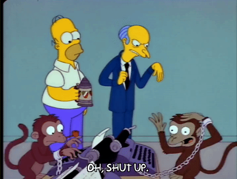

- title : OO Considered Harmful Time To Go Functional?
- description : An introduction to functional patterns and when you might use them.
- author : Jason Dryhurst-Smith
- theme : night
- transition : default

***

## Object Orientation Considered Harmful? 
# Time to go functional?

---

### A bit about me

  

#### My Name is Jason Dryhurst-Smith

#### Principle Engineer at [codat.io](https://www.codat.io)

  

#### Worked in electronics, firmware, embedded, desktop, 
#### web, health, aerospace, finance, automotive, developer tools 

---

### A few of my biases

#### 1. **Platform:** 

This is why I am using F# and C# in examples.

#### 2. **Recency Illusion:** 

Functional programming is surrounded by buzz.

#### 3. **Boring enterprise code:** 

I'm not an academic or a hacker, I write boring but hopefully hard working enterprise code.

#### 4. **Once burned twice shy:** 

Functional programming failed me.

***

# Functional FTW

---

### Data transformation

#### What goes in, must come out.

---

### Centralised Exception Handling

#### [Information Exposure Through an Error Message - CWE:209](https://cwe.mitre.org/data/definitions/209.html)

---

## Removal Of Infrastructure

#### No more dependancy injection, partial application FTW.

---

## Units for Calculation

#### Make the compiler work for it's money.

***

***

# FML Functional

---

## Vendor Libraries

#### [Bouncy Castle](http://www.bouncycastle.org/csharp/)

---

## Uncle Ben Code

#### With great power, comes great mess.

    
---

## Training

#### Getting the time to train. 

---

***

### How I would recommend getting your teams involved

  

1. Limit language scope
  
2. Limit blast radius
  
3. Introduce slowly
  
4. Talk a lot, review a lot
  
5. Build libraries not applications

---

### Don't let me put you off, but be careful.

## Functional patterns are awesome and worth it.

---

> "Yeah, but I'm not gonna let it change our lives. I'll be the same loving parent I've always been." 
#### Homer Simpson _- on newly found fame_

***

   

### Thanks
### Tweet: @jasond_s
### Email: jason@codat.io

##### Generation
**[FsReveal](https://github.com/fsprojects/FsReveal)** for slides

##### Homer
**[giphy](https://giphy.com)** for all the great Homer gifs

