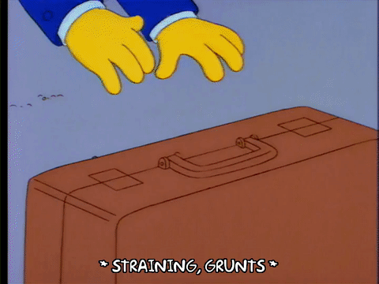

- title : OO Considered Harmful Time To Go Functional?
- description : An introduction to functional patterns and when you might use them.
- author : Jason Dryhurst-Smith
- theme : night
- transition : default

***

## Object Orientation Considered Harmful? 
# Time to go functional?

---

### A bit about me

  

#### My Name is Jason Dryhurst-Smith

#### Principle Engineer at [codat.io](https://www.codat.io)

  

#### Worked in electronics, firmware, embedded, desktop, 
#### web, health, aerospace, finance, automotive, developer tools 

---

### A few of my biases

#### 1. **Knowledge:** 

I am a .Net dev (mostly) so deepest knowledge lies here.

#### 2. **Platform:** 

This is why I am using F# and C# in examples.

#### 3. **Recency Illusion:** 

Functional programming is relatively new to me.

#### 4. **Once burned twice shy:** 

Functional programming failed me.

***

# Functional FTW

---

### Data transformation

#### What goes in, must come out.

---

### Centralised Exception Handling

#### [CWE:209](https://cwe.mitre.org/data/definitions/209.html)

---

## Removal Of Infrastructure

#### No more DI, partial application FTW.

---

## Units for Calculation

#### Make the compiler work for it's money.

***

# FML Functional

---

## Vendor Libraries

#### [Bouncy Castle](http://www.bouncycastle.org/csharp/)

---

## Uncle Ben Code

#### With great power, comes great mess.

    
---

## Training

#### Getting the time to train. 

***

### Don't let me put you off. 

## Functional patterns are awesome.

---

> "Yeah, but I'm not gonna let it change our lives. I'll be the same loving parent I've always been." 
#### Homer Simpson

---

   

### Thanks
### Tweet: @jasond_s
### Email: jason@codat.io

##### Generation
**[reveal.js](http://lab.hakim.se/reveal-js/#/)** presentation from [markdown](http://daringfireball.net/projects/markdown/)

##### Formatting
**[FSharp.Formatting](https://github.com/tpetricek/FSharp.Formatting)** for markdown parsing

##### Homer
**[giphy](https://giphy.com)** for all the great Homer gifs

