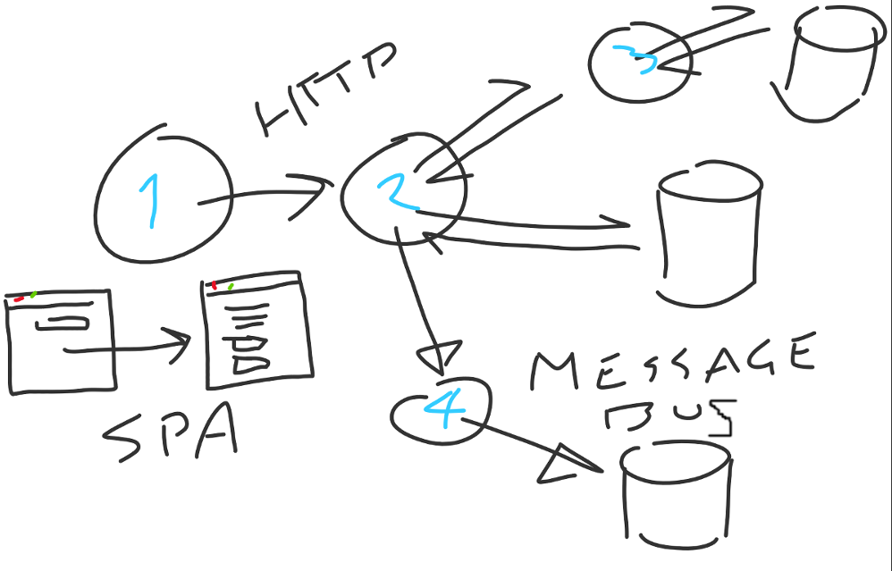
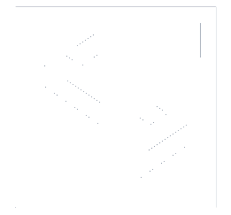

- title : CorrelatorSharp Lightning
- description : Introduction to CorrelatorSharp
- author : Jason Dryhurst-Smith
- theme : night
- transition : default

***

<h1 style="
  font-size: 100pt;
  text-shadow: none;
  background: -webkit-linear-gradient(45deg, #88FC2F, #17F2DC);
  -webkit-background-clip: text;
  -webkit-text-fill-color: transparent; font-family: 'SFComicScript'">
CorrelatorSharp
</h1>

---

## [github.com/CorrelatorSharp](https://github.com/CorrelatorSharp)

#### By Ivan Zlatev, Myself, and Others.

***

 

---

<small style="color: #ccc;">
Giphy - Moby <i>Lost City</i> - https://media.giphy.com/media/12GUPx3g0PPfYA/giphy.gif
</small>

---

<small style="color: #ccc;">
Giphy - https://media.giphy.com/media/3ov9jYkVbdGMo6UcG4/giphy.gif
</small>

---

## Core piece of code.

    [lang=cs]
    public class ActivityScope(
        string name, 
        string id, 
        string parentId) 
            : IDisposable ...

    internal static class ActivityTracker {
        static AsyncLocal<Stack<ActivityScope>> _activityStack;

        public static ActivityScope Current => 
            _activityStack.Value.Peek();

        ...
    }

#### ... Lots removed for brevity ...

---

## Simple usage

 

    [lang=cs]
    using (var scope = new ActivityScope(
        "my-do-work-scope",       // Name 
        Guid.NewGuid().ToString() // ID
        )) {

        // All the code in here has access to new scope                
        Debug.Assert(ActivityScope.Current != null);

        await DoWorkSomewhereAsync().ContinueWith(t => {

            // Thread static and async await friendly.
            Debug.Assert(ActivityScope.Current == scope);
        });
    }

---

## Middleware

### WebApi
    
    [lang=cs]
    config.Filters.Add(new CorrelationIdActionFilter());
    config.Filters.Add(new RequestLoggerActionFilter());

### Application Insights

    [lang=cs]
    public class OperationIdTelementryInitializer : ITelemetryInitializer {
        public void Initialize(ITelemetry telemetry) {
            telemetry.Context.Operation.Id = ActivityScope.Current.Id;
        }
    }

#### ... Lots removed for brevity ...

---

## Logging

### NLog

    [lang=cs]
    public class LoggerAdaptor : Logging.ILogger
    {
       public const string ActivityIdPropertyName = "cs-activity-id";
    }

    [LayoutRenderer(LoggerAdaptor.ActivityIdPropertyName)]
    public class ActivityIdLayoutRenderer : LayoutRenderer
    {
        protected override void Append(StringBuilder builder, LogEventInfo logEvent)
        {
            builder.Append(
                logEvent.Properties[LoggerAdaptor.ActivityIdPropertyName]);
        }
    }

#### ... Lots removed for brevity ...

---

## Client Side

    [lang=javascript]
    // This is the easiest way to create a new scope
    var scope = new ActivityScope('name_of_scope', null, null);

    // Activity scope is really best used as a singleton though.
    // Change the current scope.        
    ActivityScope.new('myController');

    // Nest a context as a child scope.
    ActivityScope.child('myController_child');

    // The id of the 'myController_child' scope.
    var currentCorrelationId = ActivityScope.current.id.value;

    // The id of the 'myController' scope.
    var parentCorrelationId = ActivityScope.current.parent.id.value;

    // Generate a new root scope
    ActivityScope.create('myApp');

---

## Middleware

### Angular 1

    [lang=javascript]
    angular
    .module('correlator-js-ng', ['ui.router', 'correlator-js'])
    .config(['$httpProvider', ($httpProvider) =>
        $httpProvider.interceptors.push('csHttpInterceptor');
    ])
    .run(['$rootScope', 'csActivityScope', (rootScope, activityScope) => {
        rootScope.$on('$stateChangeStart', (event, toState) =>
            activityScope.create(toState));
    }]);

#### ... Lots removed for brevity ...

---

### Single idea and multiple bits of middleware follow a few rules

#### Headers

    [lang=js]
    ActivityId: 'X-Correlation-Id'
    Name:       'X-Correlation-Name'
    ParentId:   'X-Correlation-Parent' 

#### Magic strings

    [lang=cs]
    public const string ActivityIdPropertyName = "cs-activity-id";
    public const string ParentIdPropertyName =   "cs-activity-parentid";
    public const string NamePropertyName =       "cs-activity-name";

---

# Next steps

### Moar middlewares
### Moar loggings
### Moar platforms
 
 
### Need to upgrade to NetStandadrd ASAP

***

   

### Thanks
### Tweet: @jasond_s
### Email: jason@codat.io

##### Generation
**[FsReveal](https://github.com/fsprojects/FsReveal)** for slides

##### CorrelatorSharp
**[GitHub](https://github.com/CorrelatorSharp)** for all the great codes

